# Помощник студента КБГУ

Приложение для студентов Кабардино-Балкарского государственного университета

# Особенности
* Приложение поддерживает русский и английский язык
  * Это поможет иностранным студентам с навигацией между университетами
* Расписание всегда под рукой
* Пропуск внутри приложения
  * Теперь его сложнее потерять
* Навигация между университетами
  * Поддерживате навигацию как в Google Картах, так и в Яндекс.Картах
* Поддержка тёмной темы

# Используемые библиотеки
* Android Jetpack
  * Arch Lifecycle - ViewModel и LiveData
  * Navigation - навигация внутри приложения
  * Room - работа с базой данных
* RxJava 3 - асинхронная работа
* OkHttp 4 - HTTP запросы
* Moshi - парсинг JSON
* Dagger 2 -иньекция зависимостей
* Yandex MapKit - карта для навигации между университетами
* ZXing - генерация QR-кода

# Скриншоты
# Светлая тема

  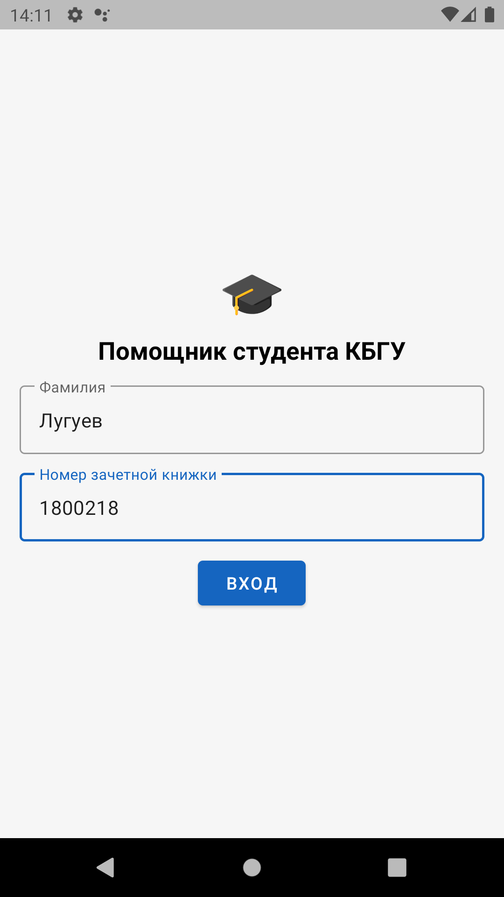
  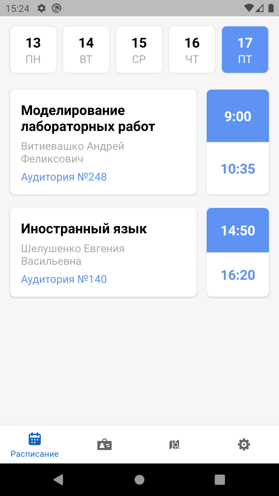
  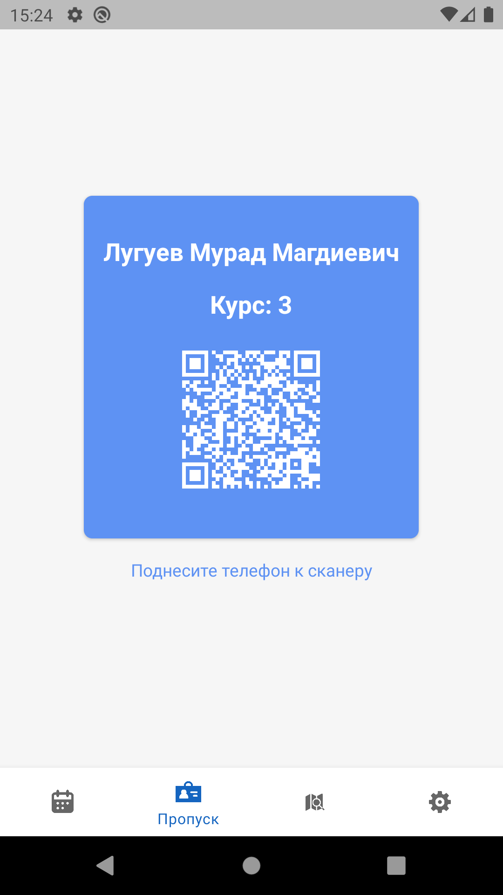
  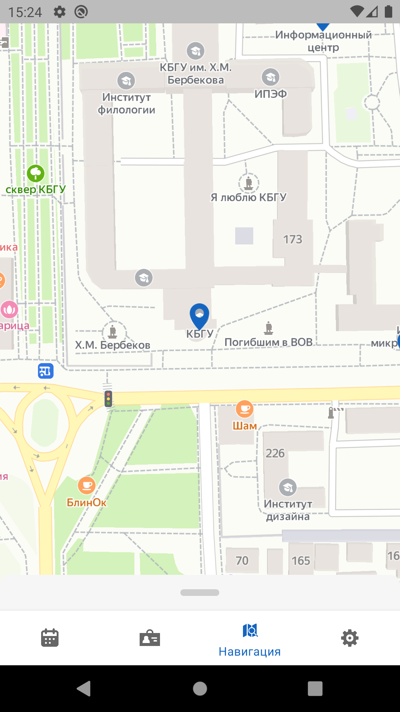
  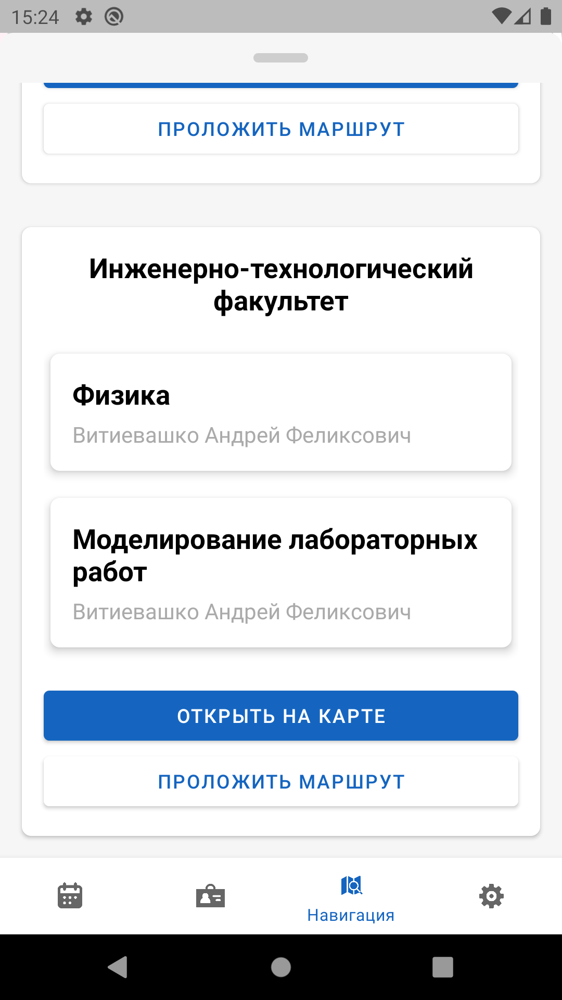
  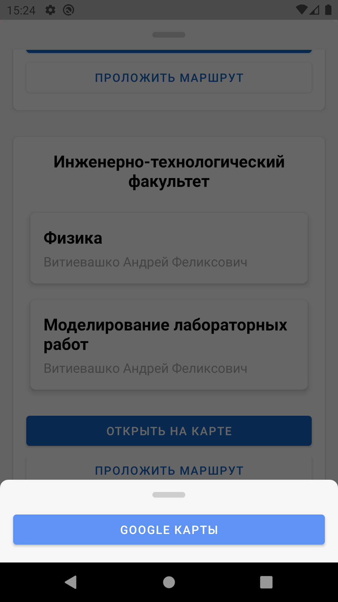

# Тёмная тема

  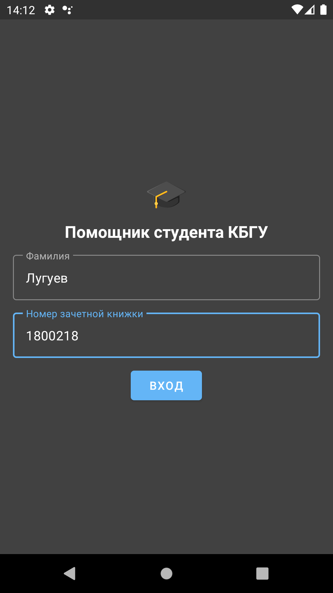
  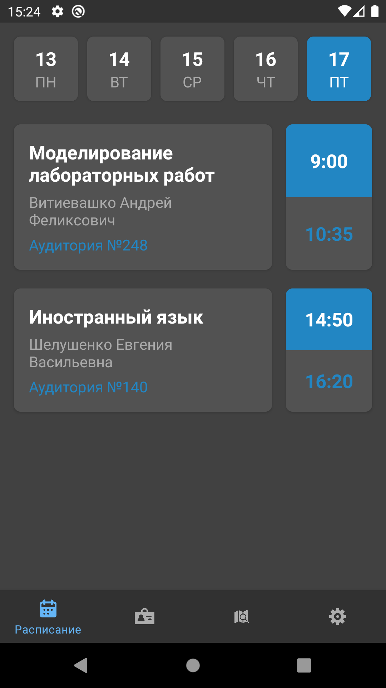
  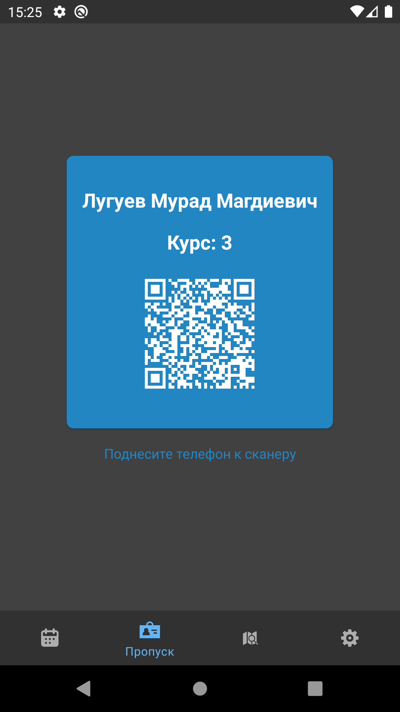
  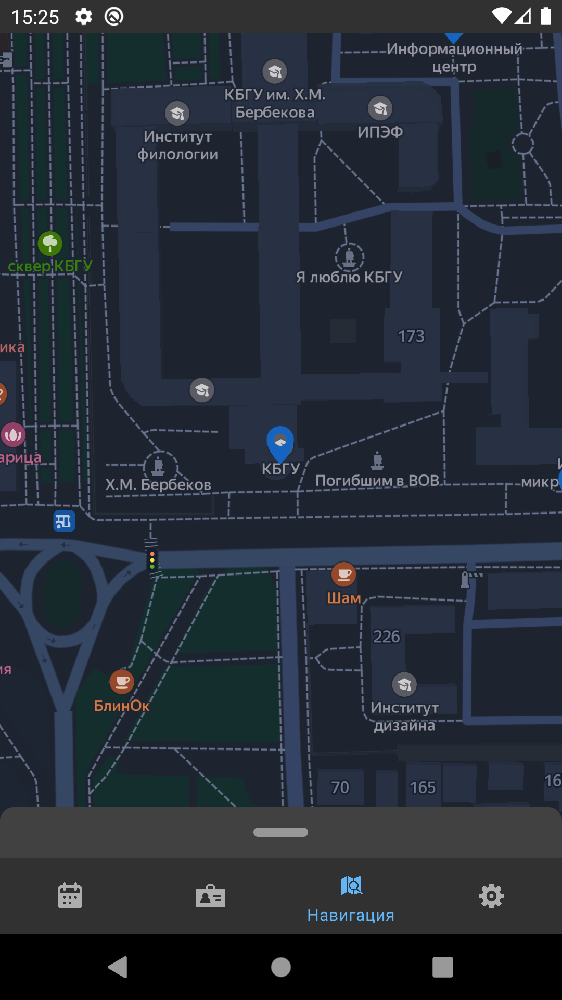
  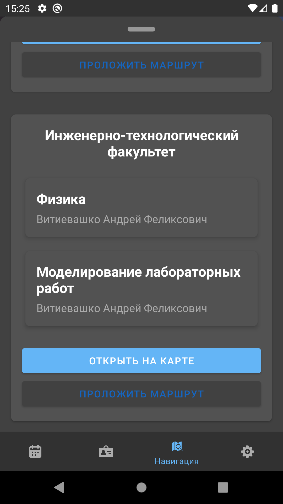
  

